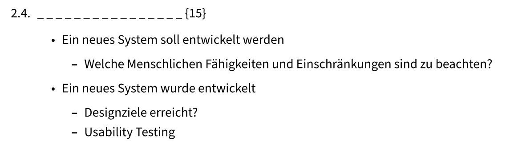
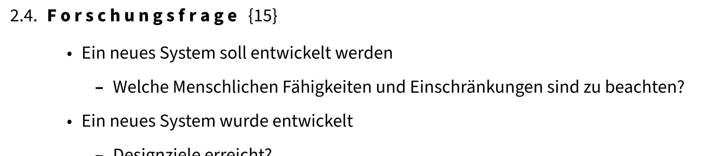

### Generates fill in the blank texts for memorizing scripts

#### Usage

```bash
python fill-in-the-blanks.py TEXT_FILE CHANCE_OF_BLANK
```

#### Rendering of markdown example using Pandoc

##### Blank text



##### Solutions

